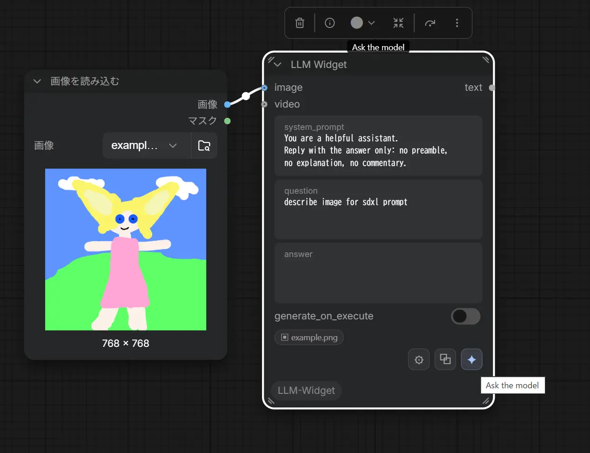
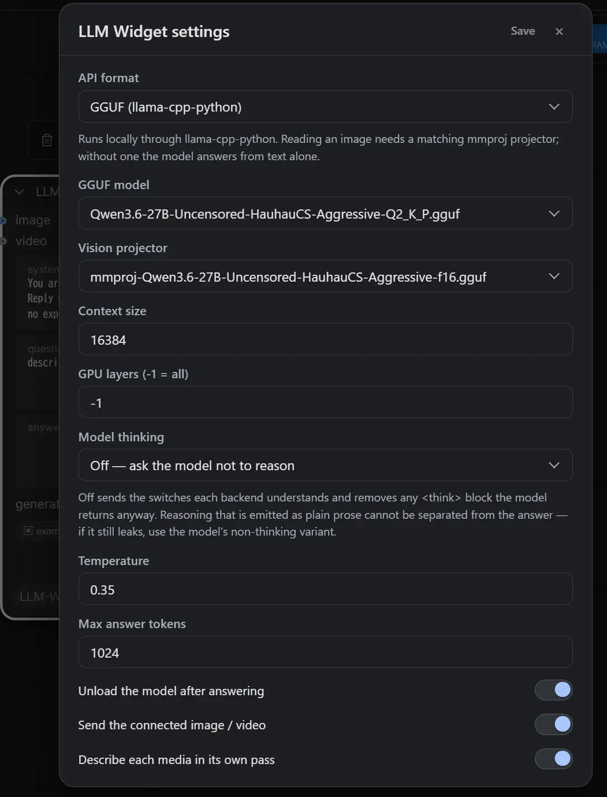

# ComfyUI-LLM-Widget

**日本語** | [English](#english)

接続した画像や動画について LLM に質問し、その答えをノード上に保持する ComfyUI ノードです。
ノードは 1 つだけです。

このノードは エディタ上で 動作します。グラフの実行より前に、グラフの実行とは無関係に動きます。
✦ ボタンを押すと答えが返ってくる。キューには何も積まれず、ワークフローの他のノードも動きません。
ワークフローの中では常時 バイパス、またはミュート した状態で置いておくことを想定しています。
処理の一段階ではなく、道具として使うノードです。

主な用途は、生成用プロンプトの下書きや書き直し、プロンプトの翻訳、参考画像の説明、
あるいは単に画像を添えて質問すること。

バックエンドは、OpenAI 互換の `/v1/chat/completions` エンドポイント、Google 純正の Gemini
`generateContent`、または `llama-cpp-python` 経由のローカル GGUF の 3 つです。

## インストール

```
cd ComfyUI/custom_nodes
git clone <this repository> ComfyUI-LLM-Widget
```

ComfyUI を再起動してください。Python の依存パッケージは追加されません。

GGUF を使う場合のみ、ComfyUI の環境に `llama-cpp-python` と、`models/text_encoders/` または
`models/LLM/` 以下の `.gguf` が別途必要です。

### vision 対応の `llama-cpp-python`

GGUF で画像を読ませるには、マルチモーダルの chat handler（`Qwen3VLChatHandler`、
`Qwen25VLChatHandler`、`Gemma4ChatHandler` など）を含むビルドが必要です。PyPI の upstream 版には
これらが 入っていないことが多い ため、handler を同梱しているフォークのリリース wheel を
インストールしてください
（[JamePeng/llama-cpp-python](https://github.com/JamePeng/llama-cpp-python/releases/)）。
handler がなくても動きますが、その場合はテキストだけを見て答えます。

`tools/install_helper.py` が必要なコマンドを組み立ててくれます。CUDA のバージョンを検出し、
PyTorch のインデックスと上記リポジトリのリリース資産を確認したうえで、指定した環境に対する
`pip install` の行をそのまま出力します。すでに最新であればその旨を表示します。

```bat
python tools\install_helper.py --python "C:\AI\ComfyUI\python_embeded\python.exe"
```

主なフラグは `--cuda cu130`（検出をスキップ。CPU ビルドなら `cpu`）、`--force`
（最新でもコマンドを出力する）、`--no-torch` / `--no-llama`。`--python` を指定すれば対象環境を
アクティベートしておく必要はありません。このフラグを省くのは対象環境が既にアクティブなときだけに
してください。そうでないと `PATH` の先頭にある Python について報告することになります。

手動で行う場合は、まず ComfyUI を停止 し、`pip freeze > requirements-backup.txt` で
バックアップを取ってから、Python のバージョン（`cp310` 〜 `cp313`）、プラットフォーム
（`win_amd64`）、ビルド種別が一致する wheel を選んで force-reinstall します。

```bat
C:\AI\ComfyUI\python_embeded\python.exe -m pip install --upgrade --force-reinstall llama_cpp_python-....whl
```

CUDA wheel のビルドタグ（`cu121`、`cu130` など）は、実際に入っている CUDA ランタイムと
一致していなければなりません。食い違うと、ファイルは確かにそこにあるのに
*cannot load ggml.dll* というエラーになります。判断がつかない場合は CPU wheel を選んでください。
入れ終えたら確認します。

```bat
C:\AI\ComfyUI\python_embeded\python.exe -c "from llama_cpp.llama_chat_format import Qwen3VLChatHandler, Qwen25VLChatHandler; print('handlers OK')"
```

ここで失敗するなら、その wheel が vision 非対応か、ComfyUI が使っているのとは別の Python に
入ってしまっています。インストールで OpenCV が許容するより新しい `numpy` が入ってしまった場合は、
`pip install --upgrade "numpy<2.3"` で戻してください（`"pillow<12"` も同様）。

## ノード

**LLM Widget**（カテゴリ: `LLM Widget`）

| スロット | 型 | 備考 |
| --- | --- | --- |
| `image`（入力） | `IMAGE` | 任意 |
| `video`（入力） | `VIDEO` | 任意 |
| `text`（出力） | `STRING` | 任意 — 通常は未使用。*実行時の動作* を参照 |

ウィジェット:

- **toolbar** — ✦ 実行（リクエスト中は ■ 停止に変わる）、経過時間、⏏ モデルを解放（Gemini 以外で
  表示）、⧉ 答えをコピー、⌫ 会話を消去（continue モードのときだけ表示）、⚙ 設定。その上には、
  接続したメディアごとに実際に送られるものを示すチップが並びます。
- **system_prompt** — 自由記述。ワークフローと一緒に保存されます。「テンプレート」と呼べるものは
  これだけです。
- **generate_on_execute** — 既定はオフ。下記参照。
- **answer** — 答えが入る場所。編集可能で、ワークフローと一緒に保存されます。continue モードでは
  ここが会話ログそのものになります（*会話を続ける* を参照）。
- **question** — 質問内容。会話ログの下、✦ ボタンのすぐ上に置いてあります。

ウィジェットの並びはモードによらず固定です。ComfyUI はウィジェットの値を **順番（インデックス）**
で保存するため、設定によって並びを変えると、一方のモードで保存したワークフローをもう一方で開いた
ときに `question` と `answer` が入れ替わってしまいます。

> **0.1.1 以前で保存したワークフロー** は `question` と `answer` が逆に読み込まれます。
> 一度だけ手で入れ替えて保存し直してください。

|ノード|設定画面|
|--|--|
|||


### 接続したメディア

エディタから送れるのは、ComfyUI の `input/`、`output/`、`temp/` フォルダに ファイルとして
既に存在するメディアだけです。`Load Image` や動画ローダーを繋ぐのは有効ですが、`VAE Decode` の
出力を繋いでも送れません。その画像はグラフを実行するまでファイルとして存在しないからです。
Reroute ノードは辿って追跡します。

どちらなのかはツールバーのチップが示します。赤い取り消し線はそのメディアがスキップされることを
意味し、実行結果でも警告として報告されます。黙って何もないまま答えさせることはしません。

チャットメッセージには動画のチャンネルがないため、OpenAI と GGUF では動画を静止画にして送ります。
候補は 1 秒に 1 枚ずつ取り、最初と最後のフレームは必ず残したうえで、残りの枠を **直前のフレーム
からの変化量が大きい順** に埋めます。動きのないショットが何枚も送られる一方で途中のカットが
まったく見えない、という等間隔サンプリングの弱点を避けるためです。枚数は `Video frames sent`
（既定 4 枚、2〜12 枚）で決めます。

間隔が等しくならないので、リクエストには各フレームの **タイムスタンプ**（`0.0s / 6.0s / 8.0s /
10.0s のうち…`）も併記します。これを書かないと、止まっているショットとカットの並びが「4 秒間の
ゆっくりした動き」として読まれてしまいます。Gemini にはファイルをそのまま渡します。

### 実行時の動作

`generate_on_execute` がオフ（既定）のとき、グラフを実行しても保存済みの `answer` が `text` 出力に
渡されるだけです。通常はこれが望ましい動作です。ノードはエディタ上で既に仕事を終えています。

ヘッドレス実行や API 実行のときはオンにしてください。質問は実行中に、実際の `IMAGE` / `VIDEO`
テンソルを使って（ファイルは不要）処理され、結果は出力に流れると同時にノードの `answer`
ウィジェットにも書き戻されます。

## 設定

⚙ のダイアログは インストール全体で共通 です。ノードごとではないので、すべての LLM Widget
ノードが 1 つのバックエンドを共有します。設定は `nodes.py` の隣の `llm_widget.json` に保存され、
このファイルは API キーを平文で 保持するため gitignore してあります。

| 設定 | 対象 | 意味 |
| --- | --- | --- |
| API format | 全て | `OpenAI-compatible`、`Gemini`、`GGUF` |
| API URL | openai / gemini | パスは自動補完されます。`http://host:1234`、`.../v1`、完全な `/v1/chat/completions` のいずれでも可 |
| API key | openai / gemini | `Authorization: Bearer` / `x-goog-api-key` として送信 |
| Model | openai / gemini | Gemini では id 単体、`models/<id>`、モデルの完全な URL のいずれでも可 |
| GGUF model | gguf | スキャン対象フォルダで見つかった `.gguf` |
| Vision projector | gguf | `auto` はモデルの隣の最初の `mmproj*.gguf` を使用。`none` はテキストのみに固定 |
| Context size | gguf | `n_ctx` |
| GPU layers | gguf | `n_gpu_layers`。`-1` で全レイヤーをオフロード |
| Model thinking | 全て | `Off`（既定）または `Keep` — *推論（thinking）* を参照 |
| Temperature | 全て | |
| Max answer tokens | 全て | ローカルバックエンドでは `max_tokens`。答えの長さの上限 |
| Continue the conversation | 全て | 前回までのやり取りも一緒に送ります — *会話を続ける* を参照 |
| Exchanges kept in the history | 全て | 送るやり取りの上限（新しい方から数えて何往復ぶんか） |
| Blank line between the log entries | 全て | ログの各ブロックの間に空行を入れるか。オフで詰めた IRC ログになります |
| Unload after answering | gguf | モデルを常駐させず、すぐに VRAM を解放。オフのままでもツールバーの ⏏ でいつでも解放できます |
| Send the connected image / video | 全て | オフにすると質問は純粋なテキストとして送られます |
| Video frames sent | 全て | 動画 1 本を何枚の静止画にするか（2〜12、既定 4）。Gemini はファイルをそのまま送るため無関係です |
| Describe each media in its own pass | gguf | 下記参照 |

### 会話を続ける（continue モード）

`Continue the conversation` をオンにすると、`answer` ウィジェットが IRC のログのような
会話ログになります。1 回のやり取りごとに次の 2 ブロックが追記され、次の質問にはその上の
やり取りが一緒に送られます。

```
<you> 猫の写真のプロンプトを書いて

<llm> a photograph of a tabby cat sitting on a windowsill, ...

<you> もう少し夕方っぽく

<llm> a photograph of a tabby cat sitting on a windowsill at golden hour, ...
```

`Blank line between the log entries` をオフにすると空行なしで詰まります。

```
<you> 猫の写真のプロンプトを書いて
<llm> a photograph of a tabby cat sitting on a windowsill, ...
<you> もう少し夕方っぽく
<llm> a photograph of a tabby cat ... at golden hour, ...
```

どちらの書き方も同じように読み取れます。ターンの終わりは次のマーカーが始まる位置なので、途中で
設定を切り替えても、それ以前のログはそのまま会話として扱われます。

会話の実体はこのテキストだけです。どこにも別の履歴は持っていません。つまり **行を書き換えれば
モデルの記憶が変わり、消せば忘れます**。ウィジェットは普通のテキストボックスのままなので、
IME も、リサイズも、undo も今までどおり効きます。ワークフローと一緒に保存されるので、
会話の続きは次に開いたときにも残っています。

- 質問を送ると `question` は空になります。質問はログの中に入っているためです。
- ⌫ でログ全体を消せます（確認あり）。continue モードのときだけ表示されます。
- 最初のマーカーより前にある文字列は会話の一部として扱いません。モードを切り替える前から
  入っていた答えなので、勝手に消さずそのまま残します。
- 過去のやり取りは **テキストだけ** を送ります。画像や動画は今回の質問にだけ付きます。
- ノードの `text` 出力に出るのは常に **最後の `<llm>` ブロックだけ** です。ログ全体が流れて
  下流を壊すことはありません。⧉ でコピーされるのも同じくその答えだけです。
- 会話が伸びればコンテキストを食います。`Exchanges kept in the history` で送る往復数を、
  ローカル GGUF なら `Context size` も合わせて調整してください。

### `Describe each media in its own pass`（GGUF）

画像と質問全体を 1 つのマルチモーダルプロンプトにまとめるのではなく、まず短いシステムプロンプトで
接続されたメディアを 1 つずつ説明させ、次にその説明だけを使って画像なしで実際の質問に答えさせます。

合計時間は長くなりますが、個々のステップは小さくなります。これが重要なのは、llama-cpp の
プロンプト評価フェーズは中断できないからです。大きなマルチモーダルプロンプトを 1 回投げることが、
エディタがしばらく固まったように見える原因です。この方式なら、メディアとメディアの間で
キャンセルが効く余地も生まれます。

説明パスにはこのモード専用のトークン上限があります。Gemma のように **推論を止める手段が無い**
モデルは、その枠を思考で使い切ってしまい、思考の途中で打ち切られた出力には答えが 1 文字も
含まれません（閉じマーカーが来ないため）。そこで Gemma 系にだけ思考ぶんの余白を上乗せしています
（`max_length` とは別枠です。どうせ捨てるテキストのための余白なので）。

それでも全部の説明が失敗した場合は、**メディアが繋がっていなかったことにはしません**。ログに警告を
出したうえで、通常どおり画像を質問に添付する経路に切り替えます。

### 停止

リクエスト実行中、✦ ボタンは ■ に変わります。押すとブラウザの fetch を中断し、同時に
サーバーにも通知します。サーバー側ではローカル GGUF をトークンの合間で止め、モデルを解放します。
キャンセル後に届いた HTTP の答えは破棄されます。モデルのロードと llama-cpp のプロンプト評価は
依然として中断できません。

### モデルの解放（⏏）

グラフを流す前に VRAM を返したいときのための明示的なボタンです。何をするかはバックエンドで
変わります。

**gguf** — GGUF は次の質問で再ロードしなくて済むように常駐します。`Unload after answering` を
オフにしている場合、⏏ がそれを解放する手段です。生成中は ⏏ が無効になり、サーバー側も実行中の
解放要求を拒否します — 生成中の `Llama` を閉じると llama-cpp ごと落ちるためです。

**openai** — ローカルサーバーに解放を依頼します。宛先は設定の API URL から導出します
（`http://127.0.0.1:1234/v1/chat/completions` → `http://127.0.0.1:1234`）。どのサーバーかは
**設定させず、常駐モデルの一覧で自動判別**します:

| | 一覧（判別に使用） | 解放 |
|---|---|---|
| LM Studio | `GET /api/v1/models` の `loaded_instances` | `POST /api/v1/models/unload` に `instance_id` |
| Ollama | `GET /api/ps` | `POST /api/generate` に `{"model": …, "keep_alive": 0}` |

互いに相手のパスを持たないので、どちらが応答したかがそのまま判別になります。解放するのは
設定した Model に一致するものだけです。タグは両側で省略可能に扱うので、`llama3.2` は
`llama3.2:latest` に一致し、LM Studio の 2 つめのインスタンス `key:2` にも一致します。一致
しなければ何もせず、実際にロードされているモデル名を返します。

どちらも応答しなければ（素の llama.cpp サーバー、クラウドのエンドポイント）その旨を表示します。
クラウドでは元より意味がありませんが、ボタンは出したままにしてあります。

なお、この判別のためだけに API format を Ollama / LM Studio / その他に分けてはいません。生成の
経路はどれも同じ `/v1/chat/completions` で、ボタン 1 つのために設定を三重化する価値がないためです。

**gemini** — 解放するものが無いのでボタン自体を出しません。

### 推論（thinking）

**Model thinking = Off**（既定）のとき、リクエストには各バックエンドが解釈できるスイッチが
すべて載ります。OpenAI 互換サーバーと llama-cpp には `chat_template_kwargs.enable_thinking=false`、
Gemini には `thinkingConfig.thinkingBudget=0`、Qwen 系には `/no_think`、llama-cpp の vision handler
には `force_reasoning=False`。未知のフィールドを拒否するエンドポイントに対しては、それを外して
もう一度送るので、厳格な API でもちゃんと答えが返ります。

Qwen3.8 はオン／オフのスイッチを **深さ** に変えました。テンプレートが読むのは `reasoning_effort`
で、既定は `xhigh` です。そのため `chat_template_kwargs` には `enable_thinking=false` と一緒に
`reasoning_effort=low`（そのテンプレートが受け付ける最も浅い値。`none` は無効）も載せます。古い
テンプレートは前者しか読まず、`reasoning_effort` を知らないテンプレートはそれを無視するだけなので、
どちらのモデルでも同じリクエストが通ります。

それでもモデルが吐いてしまったものは後処理で除去します。最後の `</think>` までが、その閉じタグ
自体も含めて削除されます。閉じタグだけを手掛かりにしているのは意図的です。ほとんどの Qwen の
チャットテンプレートは assistant ターンで `<think>` を あらかじめ開いて いるため、返ってくる
テキストは裸の推論文から始まり、開始タグはレスポンスに含まれません。タグではなく channel
マーカーを使うモデルも同様に扱います。Harmony 形式の `<|channel|>final<|message|>` に加えて、
パイプが片側だけの綴り（Gemma 4 の `<|channel>thought` … `<channel|>` のように、開始と閉じで
向きが変わるもの）も、最後のマーカーまでを推論として落とします。

マーカーが一切ない 推論（「Here's a thinking process: 1. Analyze user input…」がただの平文で
続くもの）は答えと分離できません。どこで終わるのかを示すものが何もないからです。スイッチを
送ってもこの形で漏れるモデルなら、その non-thinking 版を使ってください。

**Keep** はスイッチを一切送らず、除去も行いません。推論を読みたいときに使います。

答え全体がコードフェンスで囲まれていた場合、それを外すのは言語指定がないか、散文的な言語
（` ``` `、` ```text `、` ```prompt `）のときだけです。` ```python ` のブロックは書かれたまま
残すので、コードを頼めばコードがそのまま得られます。

## 開発

- Python の変更には ComfyUI の完全な再起動 が必要です。
- `web/*.js` の変更は ブラウザのハードリフレッシュ だけで反映されます（`WEB_DIRECTORY` 経由で配信）。
- ComfyUI なしで実行できるものはありません。検証はキャンバス上での手動確認です。

## ライセンス

MIT。`nodes.py` と `web/llm_widget_ui.js` のかなりの部分は nkxx188/ComfyUI-MiniMaxH3-Easy を
基にしており、その MIT ライセンスと著作権表示は `LICENSE` に残してあります。

---

<a id="english"></a>

# ComfyUI-LLM-Widget (English)

[日本語](#comfyui-llm-widget) | **English**

A single ComfyUI node that asks an LLM a question — optionally about a connected image or
video — and keeps the answer on the node.

It runs **from the editor**, before and independently of any graph execution. Press the ✦
button and the answer appears; nothing is queued, nothing else in the workflow runs. The
node is meant to sit in a workflow permanently **bypassed or muted**, as a tool rather than
a step.

Typical uses: drafting or rewriting a generation prompt, translating one, describing a
reference image, or just asking a question with a picture attached.

Backends: an OpenAI-compatible `/v1/chat/completions` endpoint, Google's native Gemini
`generateContent`, or a local GGUF through `llama-cpp-python`.

## Install

```
cd ComfyUI/custom_nodes
git clone <this repository> ComfyUI-LLM-Widget
```

Restart ComfyUI. No Python dependencies are added.

For the GGUF format you additionally need `llama-cpp-python` in ComfyUI's environment, and
a `.gguf` under `models/text_encoders/` or `models/LLM/` — the same folders
ComfyUI-QwenVL-F and ComfyUI-MiniMaxH3-Easy scan, so a model installed for one of them is
found here too.

### `llama-cpp-python` with vision

Reading an image through a GGUF needs a build that ships the multimodal chat handlers
(`Qwen3VLChatHandler`, `Qwen25VLChatHandler`, `Gemma4ChatHandler`, …). The upstream PyPI
package usually does **not** have them, so install a release wheel from a fork that does —
[JamePeng/llama-cpp-python](https://github.com/JamePeng/llama-cpp-python/releases/). Without
one the model still answers, from the text alone.

`tools/install_helper.py` works out the command for you. It detects the CUDA version, checks
the PyTorch index and the release assets of that repository, and prints the exact
`pip install` line for the environment you point it at — or tells you it is already current.

```bat
python tools\install_helper.py --python "C:\AI\ComfyUI\python_embeded\python.exe"
```

Useful flags: `--cuda cu130` (skip detection, `cpu` for CPU builds), `--force`
(re-emit a command even when current), `--no-torch` / `--no-llama`. With `--python` the
target environment does not have to be activated; drop the flag only when it already is,
or you will be reporting on whichever Python is first on your `PATH`.

To do it by hand: **stop ComfyUI first**, back up with `pip freeze > requirements-backup.txt`,
then pick a wheel matching your Python (`cp310` … `cp313`), your platform (`win_amd64`) and
your build type, and force-reinstall it:

```bat
C:\AI\ComfyUI\python_embeded\python.exe -m pip install --upgrade --force-reinstall llama_cpp_python-....whl
```

A CUDA wheel's build tag (`cu121`, `cu130`, …) must match the CUDA runtime you actually
have; a mismatch shows up as *cannot load ggml.dll* even though the file is right there. If
you are unsure, take the CPU wheel. Then verify:

```bat
C:\AI\ComfyUI\python_embeded\python.exe -c "from llama_cpp.llama_chat_format import Qwen3VLChatHandler, Qwen25VLChatHandler; print('handlers OK')"
```

A failure here means the wheel has no vision support, or it went into a different Python
than the one ComfyUI uses. If the install pulled in a `numpy` newer than OpenCV accepts, pin
it back with `pip install --upgrade "numpy<2.3"` (same idea for `"pillow<12"`).

## The node

**LLM Widget** (category: `LLM Widget`)

| Slot | Type | Notes |
| --- | --- | --- |
| `image` (input) | `IMAGE` | optional |
| `video` (input) | `VIDEO` | optional |
| `text` (output) | `STRING` | optional — normally unused, see *Execution* |

Widgets:

- **toolbar** — ✦ run (becomes ■ stop while a request is in flight), elapsed time, ⏏ unload
  the model (shown for every backend but Gemini), ⧉ copy the answer, ⌫ clear the conversation
  (shown in continue mode only), ⚙ settings. Above it, a chip per connected media shows what
  will actually be sent.
- **system_prompt** — free text, saved with the workflow. This is the only "template"
  there is.
- **generate_on_execute** — off by default, see below.
- **answer** — where the result lands. Editable; saved with the workflow. In continue mode this
  is the conversation log itself, see *Continuing the conversation*.
- **question** — what you are asking. It sits below the log, right above the ✦ button.

The order is the same in both modes. ComfyUI serializes widget values **by index**, so an order
that followed the setting would load a workflow saved under one mode with `question` and `answer`
swapped under the other.

> **Workflows saved with 0.1.1 or earlier** load with `question` and `answer` swapped. Swap them
> back once and save.

### Connected media

The editor can only send media that already exists as a **file** in ComfyUI's
`input/`, `output/` or `temp/` folder. Wiring a `Load Image` or a video loader works;
wiring the output of a `VAE Decode` does not, because that image has no file until the
graph runs. Reroute nodes are followed through.

A chip in the toolbar tells you which it is — struck through and red means the media
will be skipped, and the run reports it as a warning rather than letting the model invent
a description.

Videos are sampled into stills for the OpenAI and GGUF formats, since a chat message has no
video channel. Candidates are taken at one per second; the first and the last frame are
always kept, and what is left of the budget goes to the frames that **changed most** from
the one before them — so a held shot is not sent several times over while the cut in the
middle of the clip goes unseen. How many stills you get is `Video frames sent` (4 by
default, 2–12).

Because that spacing is deliberately uneven, the request also states each still's
**timestamp** (`at 0.0s / 6.0s / 8.0s / 10.0s of a 10.0s clip…`). Without it a held shot
followed by a cut reads as four steady seconds of slow motion. Gemini receives the file
whole.

### Execution

With `generate_on_execute` off (the default), running the graph just hands the stored
`answer` to the `text` output. This is what you want: the node has already done its work in
the editor.

Turn it on for a headless or API run. The question is then answered during execution, using
the actual `IMAGE`/`VIDEO` tensors (no file needed), and the result is pushed back into the
node's `answer` widget as well as onto the output.

## Settings

The ⚙ dialog is **installation-global**, not per-node — all LLM Widget nodes share one
backend. It is stored in `llm_widget.json` next to `nodes.py`, which holds a **plaintext
API key** and is gitignored.

| Setting | Applies to | Meaning |
| --- | --- | --- |
| API format | all | `OpenAI-compatible`, `Gemini`, or `GGUF` |
| API URL | openai / gemini | The path is completed for you: `http://host:1234` , `.../v1` and a full `/v1/chat/completions` all work |
| API key | openai / gemini | Sent as `Authorization: Bearer` / `x-goog-api-key` |
| Model | openai / gemini | For Gemini a bare id, `models/<id>` or a full model URL are all accepted |
| GGUF model | gguf | Any `.gguf` found under the scanned folders |
| Vision projector | gguf | `auto` picks the first `mmproj*.gguf` next to the model; `none` forces text-only |
| Context size | gguf | `n_ctx` |
| GPU layers | gguf | `n_gpu_layers`, `-1` offloads everything |
| Model thinking | all | `Off` (default) or `Keep` — see *Reasoning* |
| Temperature | all | |
| Max answer tokens | all | `max_tokens` for the local backends, the answer length cap |
| Continue the conversation | all | Send the earlier turns along with the question — see *Continuing the conversation* |
| Exchanges kept in the history | all | How many of the most recent exchanges are replayed |
| Blank line between the log entries | all | Whether the log's blocks are separated by a blank line. Off gives a tight IRC log |
| Unload after answering | gguf | Frees VRAM immediately instead of keeping the model resident. Leave it off and use the toolbar's ⏏ when you want the VRAM back |
| Send the connected image / video | all | Off means the question is asked as pure text |
| Video frames sent | all | How many stills one video becomes (2–12, default 4). Not used by Gemini, which gets the file whole |
| Describe each media in its own pass | gguf | See below |

### Continuing the conversation

With `Continue the conversation` on, the `answer` widget becomes an IRC-style log. Every turn
appends two blocks to it, and the exchanges above the question are sent with the next one:

```
<you> Write a prompt for a photo of a cat

<llm> a photograph of a tabby cat sitting on a windowsill, ...

<you> More like early evening

<llm> a photograph of a tabby cat sitting on a windowsill at golden hour, ...
```

Turn `Blank line between the log entries` off and the blocks are written tight:

```
<you> Write a prompt for a photo of a cat
<llm> a photograph of a tabby cat sitting on a windowsill, ...
<you> More like early evening
<llm> a photograph of a tabby cat ... at golden hour, ...
```

Both spellings read back the same — a turn ends where the next marker begins — so switching the
setting mid-conversation leaves the earlier log perfectly readable.

That text is the entire conversation — there is no history stored anywhere else. **Edit a line
and you change what the model remembers; delete one and it forgets.** The widget is still an
ordinary text box, so IME composition, resizing and undo all work as before, and the log is
saved with the workflow like any other widget value.

- Sending a question clears the `question` box, since the question is in the log by then.
- ⌫ clears the whole log (it asks first). It is only shown in continue mode.
- Anything above the first marker is not treated as part of the conversation. It is whatever
  the field held before the mode was switched on, and it is left alone rather than deleted.
- Earlier turns are sent as **text only**; a connected image or video is attached to the
  current question.
- The node's `text` output is always the **last `<llm>` block alone**, so the whole log never
  leaks into whatever is wired downstream. ⧉ copies that same reply.
- A long conversation costs context. Tune `Exchanges kept in the history` — and, for a local
  GGUF, `Context size` with it.

### `Describe each media in its own pass` (GGUF)

Instead of putting the images and the whole question in one multimodal prompt, the model
first describes each connected media on its own with a short system prompt, then answers
the actual question from those descriptions with no images attached.

It is slower in total but each individual step is small, which matters because llama-cpp's
prompt-evaluation phase cannot be interrupted — a single large multimodal prompt is the
reason the editor can appear frozen for a while. It also gives cancellation a chance to
land between assets.

The describe pass has a token budget of its own. A model whose reasoning **cannot be switched
off** — Gemma has no `/no_think` and its chat handler rejects the flag — spends that budget on
the thought, and an output cut off mid-thought contains no answer at all, since the closing
marker never arrives. Gemma-family models therefore get extra headroom on top (separate from
`max_length`, because it pays for text that is discarded anyway).

If every description fails regardless, the run does **not** pretend no media was connected: it
logs a warning and falls back to attaching the images to the question, the way the mode does
when it is off.

### Stopping

While a request is running the ✦ button becomes ■. Pressing it aborts the browser's fetch
*and* tells the server, which stops a local GGUF between tokens and releases the model. An
HTTP answer that arrives after a cancel is discarded. Model loading and llama-cpp's prompt
evaluation still cannot be interrupted.

### Unloading the model (⏏)

The explicit way to hand VRAM back before queueing the graph. What it does depends on the
backend.

**gguf** — a GGUF stays resident so the next question does not reload it, and with `Unload
after answering` off nothing ever frees it. ⏏ does. It is disabled while a generation is
running and the server refuses the request too: closing a `Llama` that is still generating
takes llama-cpp down with it.

**openai** — asks the local server to free it. The address comes from the configured API URL
(`http://127.0.0.1:1234/v1/chat/completions` → `http://127.0.0.1:1234`). Which server it is
**is detected rather than configured**, by asking what it has resident:

| | Listing (the detection) | Unload |
|---|---|---|
| LM Studio | `GET /api/v1/models` → `loaded_instances` | `POST /api/v1/models/unload` with `instance_id` |
| Ollama | `GET /api/ps` | `POST /api/generate` with `{"model": …, "keep_alive": 0}` |

Neither server has the other's route, so whichever answers *is* the answer. Only models
matching the configured Model are unloaded, with the tag optional on both sides: `llama3.2`
matches `llama3.2:latest`, and a second LM Studio instance's `key:2` matches its key. If
nothing matches, nothing is unloaded and the reply says what *is* resident.

If neither answers — a plain llama.cpp server, a cloud endpoint — it says so. Pointless
against the cloud, but the button is left visible anyway.

The API format is deliberately *not* split into Ollama / LM Studio / other for this: every one
of them generates through the same `/v1/chat/completions`, and tripling the settings for one
button is not worth it.

**gemini** — nothing to free, so the button is not shown.

### Reasoning

With **Model thinking = Off** (the default) the request carries every switch the backends
understand — `chat_template_kwargs.enable_thinking=false` for OpenAI-compatible servers and
llama-cpp, `thinkingConfig.thinkingBudget=0` for Gemini, `/no_think` for the Qwen family,
`force_reasoning=False` on the llama-cpp vision handler. An endpoint that rejects the
unknown field gets the request again without it, so a stricter API still answers.

Qwen3.8 turned that on/off switch into a **depth**: its template reads `reasoning_effort`
and defaults to `xhigh`. `chat_template_kwargs` therefore carries `reasoning_effort=low` —
the shallowest value the template accepts, `none` is not one of them — alongside
`enable_thinking=false`, not instead of it: older templates read only the latter, and a
template that has never heard of the variable simply ignores it.

Whatever a model emits anyway is cleaned up afterwards: everything up to and including the
**last** closing `</think>` is removed. The closing tag alone is enough on purpose — most
Qwen chat templates *pre-open* `<think>` in the assistant turn, so what comes back starts
with bare reasoning prose and the opening tag is never in the response. Models that mark
their reasoning with channels instead of tags are handled the same way: Harmony's
`<|channel|>final<|message|>`, and the half-piped spellings too — Gemma 4 opens with
`<|channel>thought` and closes with `<channel|>`, and everything up to that last marker goes.

Reasoning that carries **no marker at all** ("Here's a thinking process: 1. Analyze user
input…" as plain text) cannot be separated from the answer — nothing says where it stops.
If a model leaks like that despite the switches, use its non-thinking variant.

**Keep** sends none of the switches and strips nothing, for when you want to read the
reasoning.

A fenced answer is unwrapped only when the fence has no language or a prose-ish one
(` ``` `, ` ```text `, ` ```prompt `). A ` ```python ` block is left exactly as written, so
asking for code still gives you code.

## Development

- Python changes need a **full ComfyUI restart**.
- `web/*.js` changes need only a **browser hard refresh** (served via `WEB_DIRECTORY`).
- There is nothing to run without a ComfyUI installation; verification is manual on the
  canvas.

## License

MIT. Substantial parts of `nodes.py` and `web/llm_widget_ui.js` are adapted from
nkxx188/ComfyUI-MiniMaxH3-Easy, whose MIT license and copyright notice are kept in `LICENSE`.
